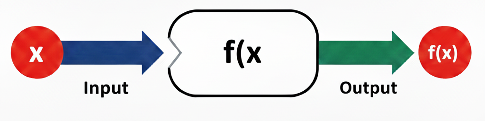
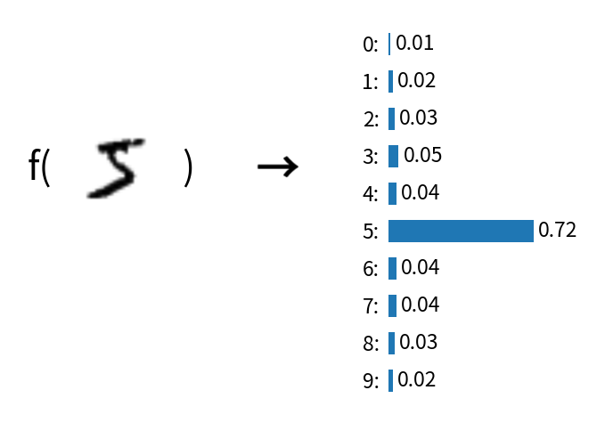
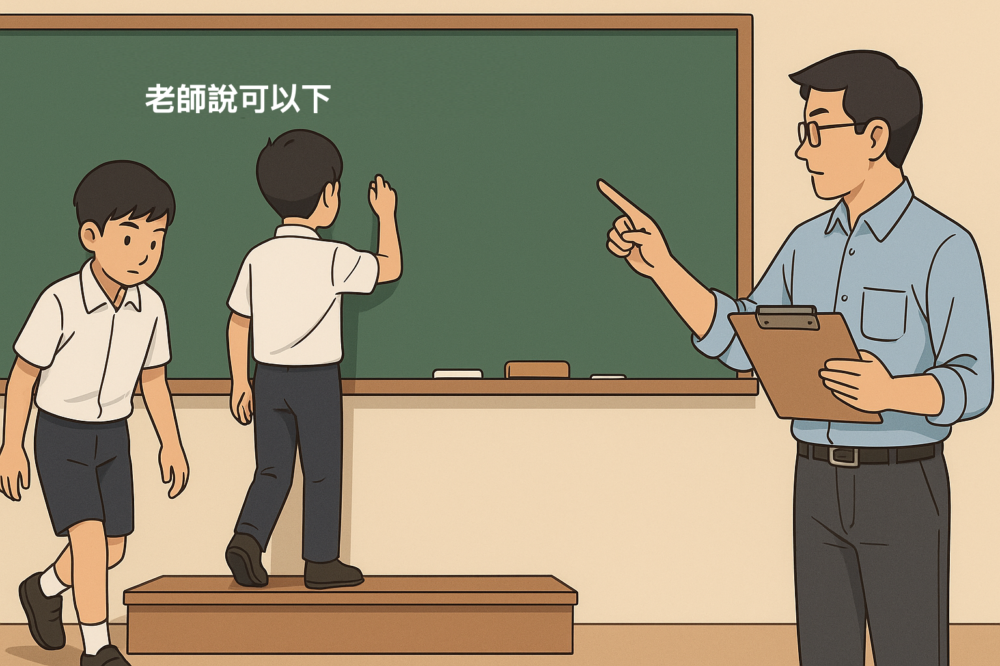
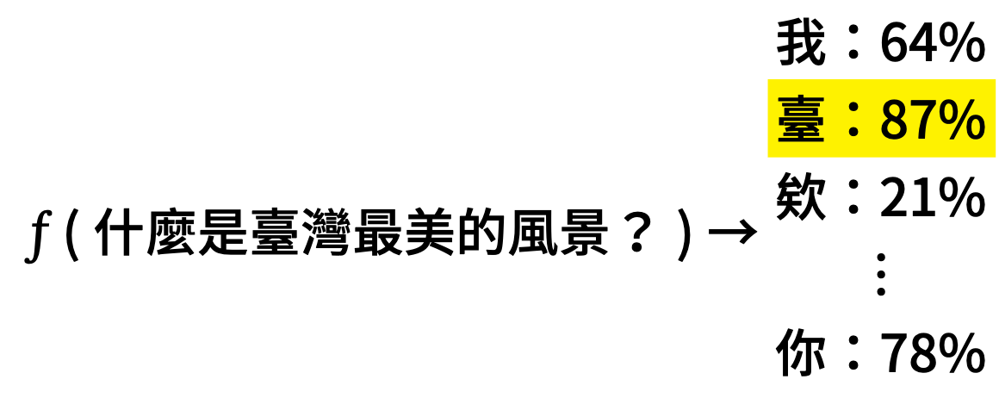
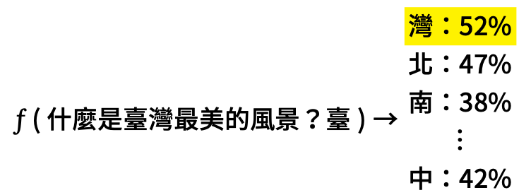
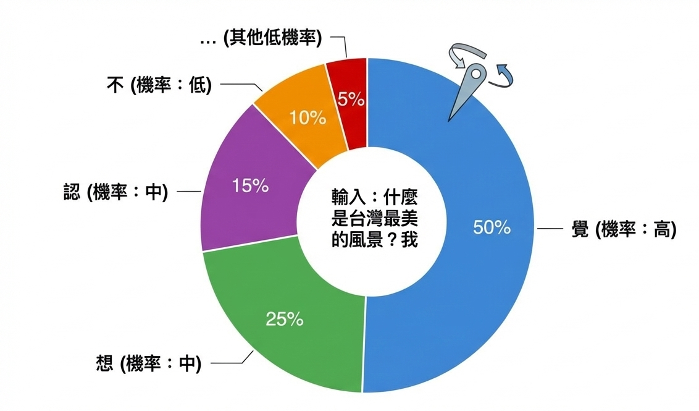

#+title: 和 AI 作朋友——高中生的 AI 工具箱
#+AUTHOR: 臺南一中 顏永進
#+DATE: 2026-04-30
#+SUBTITLE: 雲林場高中生 AI 工作坊
#+INCLUDE: ../pdf.org
#+OPTIONS: toc:2 ^:nil num:5
#+OPTIONS: H:4
#+HTML_HEAD: <link rel="stylesheet" type="text/css" href="../../css/muse.css" />

* 今天要做什麼？

用 AI 工具，從零開始完成一份台灣史小論文。

主題：*為什麼日本人選雲林蓋糖廠？*

| 步驟 | 用什麼工具              | 你會得到什麼                   |
|------+-------------------------+--------------------------------|
|    1 | NotebookLM              | 研究筆記（含出處）             |
|    2 | Napkin                  | 因果關係圖                     |
|    3 | Claude（claude.ai）     | 小論文 Word 檔（初稿）         |
|    4 | ChatGPT                 | 改好的反思段落，貼回 Word       |
|    5 | Gamma 或 Claude         | 報告簡報                       |

每一步的產出直接餵進下一步，最後你手上會有：一份 Word + 一份簡報。

* 想不到題目？從這裡挑一個

老師示範的是「為什麼是雲林？」，你也可以選自己有興趣的：

| 編號 | 題目                                                         | 建議素材  |
|------+--------------------------------------------------------------+----------|
|    1 | 虎尾糖廠的冰為什麼特別好吃？——從一支冰棒認識糖廠還在做什麼   | 13, 3, 10 |
|    2 | 阿公阿嬤口中的「糖廠」是什麼樣子？——家族記憶裡的糖廠生活     | 4, 6, 10 |
|    3 | 那條鐵軌為什麼還在？——五分車從載甘蔗到載觀光客的故事         | 12, 2, 6 |
|    4 | 為什麼虎尾以前叫「糖都」？——一個小鎮怎麼變成全台最重要的糖廠 | 2, 4     |
|    5 | 日本人為什麼來雲林種甘蔗？——你家附近的田，一百年前可能是甘蔗園 | 4, 1, 11 |
|    6 | 糖廠旁邊那些舊房子該拆掉嗎？——老建築保存 vs. 蓋新東西的兩難 | 12, 11   |
|    7 | 一顆方糖的旅程——從田裡的甘蔗到你桌上的糖，中間經過什麼？     | 4, 5, 13 |
|    8 | 糖廠關了，然後呢？——虎尾糖廠現在變成什麼樣子               | 13, 12, 10 |

建議素材欄的編號對應底下的素材清單。也歡迎自己想題目！

* Step 1：NotebookLM——讀懂素材

打開 [[https://notebooklm.google.com][NotebookLM]]（用 Google 帳號登入），上傳素材（見底下素材清單），然後問問題。

** 可以問的問題（參考）

- 「根據這些資料，日本人為什麼選擇在雲林虎尾設立糖廠？」
- 「戊戌大水災跟糖廠設立的關係是什麼？請引用原文。」
- 「虎尾糖廠跟橋頭糖廠比起來，設廠條件有什麼不同？」
- 「如果我要寫一篇小論文，題目是『為什麼是雲林？』，大綱可以怎麼寫？」

** 最後一步：請 NotebookLM 幫你打包

問完所有問題之後，貼這段指令，讓它把零碎的回答整合成一份研究筆記：

#+begin_quote
請把我們剛才所有對話的內容整合成一份「研究筆記」，格式如下：

一、研究問題：（你的題目）
二、關鍵發現：列出所有重要事實，每一點後面標明出處（來源文件名稱），例如：「1897 年戊戌大水災沖出大量溪埔地（出處：楊彥騏，〈近代產業——雲林糖業的興衰〉）」
三、比較分析：（如果有比較的話）
四、建議大綱：小論文的章節架構
五、參考資料清單：列出所有引用過的文件名稱與作者
#+end_quote

→ 複製這份研究筆記，Step 3 會用到。

* Step 2：Napkin——畫一張圖

打開 [[https://www.napkin.ai][Napkin]]，把你的研究重點貼進去，它會自動生成圖表。

例如貼這段：

#+begin_quote
日本選擇在雲林虎尾設立糖廠的原因：
1. 天災創造機會：1897 戊戌大水災沖出大量溪埔地，成為無主地
2. 自然條件適合：雲林平原日照充足、雨量適中
3. 政策推動：1902 年台灣總督府頒布糖業獎勵規則
4. 企業家眼光：鈴木藤三郎看中虎尾的潛力，1906 年設廠
5. 國家需求：日俄戰爭後，日本需要糖的自給自足
#+end_quote

→ 產出的圖可以放進小論文或簡報裡。

* Step 3：Claude——生成小論文 Word 檔

打開 [[https://claude.ai][claude.ai]]（免費帳號即可），按照以下順序貼：

1. 先貼 *小論文格式規範* （見底下附錄，整段複製）
2. 再貼 *Step 1 的研究筆記*
3. 最後貼以下指令：

#+begin_quote
請根據上面的格式規範和素材，整理成一份小論文，輸出為 Word 檔（.docx）。

基本資訊：
- 投稿類別：史地類
- 篇名：（你的題目）
- 作者：（你的姓名。學校。年級）
- 指導老師：（填你的老師）

請遵守格式規範，並根據素材中的出處自動生成「肆、引註資料」段落。反思段落請用高中生的口吻寫。
#+end_quote

→ Claude 會生成一個可以下載的 Word 檔，點「下載」就拿到。

** 下載後一定要做的事

1. 打開 Word，把 AI 的用詞換成你自己的口吻
2. 檢查人名、年份有沒有被 AI 改掉或編出來
3. 反思段落先留著，下一步會改

* Step 4：ChatGPT——用 AI 當教練改反思

打開 [[https://chatgpt.com][ChatGPT]]，把 Word 裡的反思段落貼進去，用 AI 當教練修改。

** 怎麼問才不會得到罐頭回答？

爛 prompt（不要這樣問）：
#+begin_quote
幫我寫一段學習歷程反思
#+end_quote

好 prompt（這樣問）：
#+begin_quote
我住雲林，常經過虎尾糖廠，以前只覺得是一個老地方。這次研究之後才知道，原來日本人選雲林蓋糖廠不是巧合，是因為一場水災沖出了大片空地。幫我用這個「從不在意到覺得驚訝」的轉變，寫一段反思初稿。風格要像高中生自己寫的，不要太文言，300字以內。
#+end_quote

** 接著用 AI 改，不是用 AI 寫

拿到初稿後，繼續問：

- 「這段反思沒有連結到我的研究問題，幫我指出哪裡可以改。」
- 「給我三種不同角度：我學到了什麼 / 我對家鄉的看法改變了什麼 / 我還想探索什麼」
- 「這句話怎麼改更有力？」

至少來回三輪，改到你滿意為止。改好後貼回 Word 檔，取代原本 AI 寫的罐頭反思。

* Step 5：Gamma——做簡報

打開 [[https://gamma.app][Gamma]]，把 Word 的內容貼進去，輸入：

#+begin_quote
高中歷史課程學習成果報告簡報。
標題：（你的題目）
內容包含：
一、研究動機
二、研究發現（重點整理）
三、學習反思
#+end_quote

→ 30 秒生成簡報，記得刪掉 AI 亂加的內容、補上你自己的話。

也可以用 [[https://claude.ai][claude.ai]] 直接生成 .pptx 檔下載。

* AI 到底怎麼辦到的？

** AI 的本質是「函數」

你在國中數學學過函數：輸入一個值，經過某個規則，得到一個輸出。

#+begin_example
華氏溫度 = 1.8 × 攝氏溫度 + 32
#+end_example

AI 做的事情其實一模一樣，只是函數複雜得多：

| 任務         | 輸入           | → f →  | 輸出              |
|--------------+----------------+--------+-------------------|
| 手寫辨識     | 一張圖片       | → f →  | 0~9 各數字的機率   |
| 貓狗辨識     | 一張照片       | → f →  | 貓 90%、狗 10%    |
| 文字生成     | 一段提示詞     | → f →  | 生成的文字        |
| 影像生成     | 一段描述       | → f →  | 生成的圖片        |

不管 AI 看起來多厲害，骨子裡都是：*輸入 → 函數 → 輸出*。

#+ATTR_HTML: :width 500px

#+ATTR_HTML: :width 600px

差別只在於函數裡面有幾千億個參數（GPT-4 有超過一兆個），這些參數是從海量資料中「學」出來的。

** 生成式 AI 是「會接龍的函數」

既然 AI 是函數，那生成式 AI 是什麼樣的函數？

答案：*一個每次只猜下一個字的函數，不斷把自己的輸出接回輸入，像接龍一樣。*

#+ATTR_HTML: :width 650px

以「什麼是臺灣最美的風景？」為例：

#+ATTR_HTML: :width 700px

#+ATTR_HTML: :width 600px

#+begin_example
f("什麼是臺灣最美的風景？")           → 臺（機率最高）
f("什麼是臺灣最美的風景？臺")         → 灣
f("什麼是臺灣最美的風景？臺灣")       → 最
f("什麼是臺灣最美的風景？臺灣最")     → 美
  ……
f("什麼是臺灣最美的風景？臺灣最美的風景是") → 人
#+end_example

就像你在 LINE 上打字，鍵盤會自動建議下一個字——AI 做的是同一件事，只是它猜得非常非常準。

但它不是每次都選機率最高的字——像轉輪盤一樣，機率高的字比較容易被選中，但不是一定：

#+ATTR_HTML: :width 400px

AI 會加入一點隨機性（叫做「溫度參數」），讓回答更多樣。這也是為什麼你問同一個問題兩次，可能會得到不同的答案。

** Token：AI 眼中的世界

AI 看到的不是文字，而是 Token（一小段一小段的碎片）。

打開 [[https://platform.openai.com/tokenizer][OpenAI Tokenizer]] 試試看：
- 輸入「虎尾糖廠」，看它被切成幾個 token
- 再輸入「314159」，你會發現數字的切法跟你想的完全不一樣
- 這就是為什麼 AI 有時候數學會算錯——它看到的不是「數字」，是碎片

** AI 怎麼被訓練出來的？

| 階段 | 做了什麼                       | 學會什麼           |
|------+--------------------------------+--------------------|
|    1 | 讀了整個網路的文字             | 語言的模式和規律   |
|    2 | 針對特定任務練習（Fine-tuning） | 怎麼當助理         |
|    3 | 人類告訴它什麼是好答案（RLHF） | 怎麼避免有害回應   |

** 幻覺（Hallucination）——AI 也會騙你

AI 有時候會一本正經地「編故事」，講得頭頭是道，但整段都是假的。這叫「幻覺」。

*** 實驗：用同一個問題去測四個 AI

請分別打開以下四個 AI，貼上 *完全相同的問題* ，比較它們的回答：

- [[https://chatgpt.com][ChatGPT]]
- [[https://claude.ai][Claude]]
- [[https://gemini.google.com][Gemini]]
- [[https://grok.com][Grok]]

問這個問題：

#+begin_quote
請描述 1920 年雲林農民組合抗議虎尾糖廠壓低甘蔗收購價格的經過
#+end_quote

*** 觀察重點

看看四個 AI 的回答：
- 有沒有講出具體的人名、日期、地點？
- 四個 AI 講的是同一件事嗎？還是各說各話？
- 有沒有 AI 承認「我不確定」或「找不到相關資料」？
- 把它們的回答拿去跟 NotebookLM 裡的素材比對——有哪些是真的、哪些是編的？

*** 結論

- AI 不是知識庫，是語言模型——它擅長的是「組織語言」，不是「記住事實」
- 四個 AI 可能給你四個不同版本的「歷史」，但真正的歷史只有一個
- *寫學習歷程的警告*：大學教授一年看幾千份，你掰的他看得出來
- 所以才需要 NotebookLM——有餵資料、有出處的回答，才值得信任

** 什麼東西不該丟給 AI？

AI 很強，但你打進去的每一個字，都會離開你的電腦。

要小心的東西：
- 日記、心情筆記、感情問題、家裡狀況
- 同學的個資、輔導紀錄
- 還沒公開的競賽作品、原創小說

一個判準：*「這段話如果被截圖貼到網路上，我會崩潰嗎？」* 會 → 別丟雲端。

* 你現在手上有什麼？

| 成品                         | 來自哪一步 |
|------------------------------+------------|
| 研究筆記（含出處）           | Step 1     |
| 因果關係圖                   | Step 2     |
| 小論文 Word 檔（含反思定稿） | Step 3 + 4 |
| 報告簡報                     | Step 5     |

* 三個帶走的觀念

1. *AI 幫你加速，不是幫你代寫* ——最後掛名的是你
2. *你給 AI 多少「你的樣子」，它就回給你多少「你的樣子」* ——好的 prompt 比好的工具重要
3. *一定要自己檢查* ——AI 會編造事實，四個 AI 可能給你四個版本的「歷史」

* 素材清單——上傳到 NotebookLM

點開連結 → 瀏覽器按 =Ctrl+P= （Mac 按 =⌘+P= ）→ 「儲存為 PDF」→ 上傳到 NotebookLM。

** 主要素材（建議都上傳）

1. [[https://zh.wikipedia.org/zh-tw/%E8%87%BA%E7%81%A3%E7%B3%96%E6%A5%AD%E5%8F%B2][臺灣糖業史——維基百科]]（列印存 PDF）
2. [[https://vocus.cc/article/6667e00efd89780001a6eb91][臺灣「糖都」之父——虎尾糖廠]]（列印存 PDF）
3. [[https://www.taisugar.com.tw/chinese/Attractions_detail.aspx?n=10048&s=69&p=0][虎尾糖廠製糖工場——台糖官網]]（列印存 PDF）
4. [[https://www.twcenter.org.tw/wp-content/uploads/2015/05/g02_07_02_05.pdf][近代產業——雲林糖業的興衰（楊彥騏）]]（直接下載 PDF）
5. [[https://the.nmth.gov.tw/Uploads/Resource/Files/98d11ec4-cec9-42b0-9bcc-a3d281ceab7b.pdf][甜蜜蜜的時空之旅——臺灣糖業故事（台史博）]]（直接下載 PDF）

** 更多素材（有興趣再加）

6. [[https://smiletaiwan.cw.com.tw/article/4141][探訪糖與蜜之地——雲林虎尾百年糖廠（微笑台灣）]]
7. [[https://digitalarchives.tw/Exhibition/2424/1.html][從糖業的興衰看糖鄉虎尾的潛力（數位典藏）]]
8. [[https://opendata.culture.tw/frontsite/sugar][文化資料開放服務網——糖業的過去與現在（文化部）]]
9. [[https://www.taisugar.com.tw/monthly/CPN.aspx?ms=1495&p=13389178&s=13389186][臺灣糖業小史 1620-1901（台糖通訊）]]
10. [[https://www.taisugar.com.tw/monthly/CPN.aspx?ms=1485&p=13388859&s=13388881][虎糖與糖都所交織的特殊風情（台糖通訊）]]
11. [[https://curation.culture.tw/curation/public?id=1702][虎尾糖廠——國家文化記憶庫線上策展]]
12. [[https://ourisland.pts.org.tw/content/1084][台灣蔗糖的晚年記事——糖廠轉型困境（公視《我們的島》）]]
13. [[https://www.huweisugar.com/Course/Detail/3fba5042-a243-45f0-af61-1e6cb9f38ff4][說糖 HUWEI SUGAR——虎尾糖業文化路徑]]

* 附錄：小論文格式規範（整段複製，貼給 Claude）

格式說明原始 PDF：[[https://www.cdjh.hc.edu.tw/uploads/1589183819709PERVPvtb.pdf][點此下載]]

#+begin_example
【全國高級中等學校小論文寫作比賽格式說明】

壹、篇幅要求
小論文篇幅以 A4 紙張 4-10 頁為限（不含封面）。

貳、版面要求
一、使用新細明體 12 級字打字，不可放大字型，單行間距，邊界上下左右各留 2 公分。
二、版面編排
  （一）所有標題皆須單獨成行。
  （二）標題與段落之間要空一行。
  （三）段落與段落之間要空一行。
  （四）段落開頭與一般中英文寫作相同。
三、頁首及首尾：每頁頁首需加入小論文篇名，頁尾插入頁碼。文字為 10 級字、置中。

參、格式說明
小論文之基本架構分為「封面頁」及四大段落：「壹、前言」、「貳、正文」、「參、結論」、「肆、引註資料」

一、封面頁
  （一）單獨一頁、不編頁碼。
  （二）含投稿類別、小論文篇名、作者及指導老師。
  （三）不能有插圖。
  （四）作者依「姓名。學校。部別/年級」之順序編排。

二、前言
  為何選擇這個題目，透過什麼方法、運用什麼概念進行資料搜集，整篇文章的討論架構與範圍，以及想要達成的目的。

三、正文
  （一）「正文」為小論文之主體所在。
  （二）分層次、分段來條列說明。層次：一、→（一）→ 1、→（1）
  （三）強調相關資料的引用、彙整、分析、辯證。
  （四）引用別人資料需加註來源，直接引用原文以粗體加「」標明，標註（作者，年代）。
  （五）同一處引用原文不得超過 50 字。
  （六）圖/表需有編號及標題。圖編號在下，表編號在上，需註明資料來源。圖不得超過頁面 1/4。

四、結論
  研究過程中的思考、根據研究結果提出看法、未來值得進一步研究的方向。

五、引註資料
  至少 3 篇，不得全部來自網站。
#+end_example
