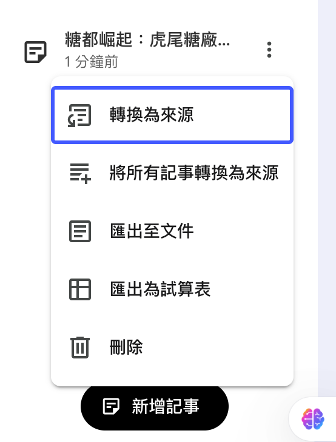
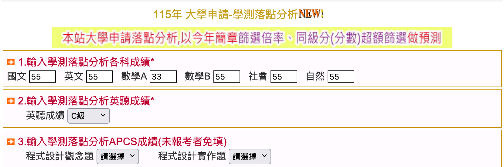
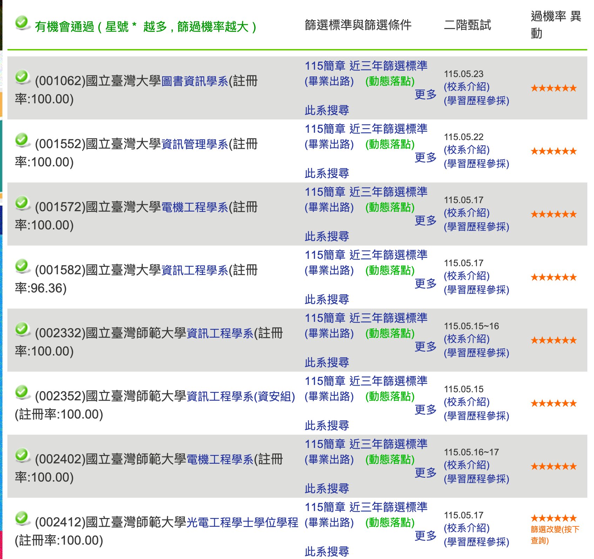
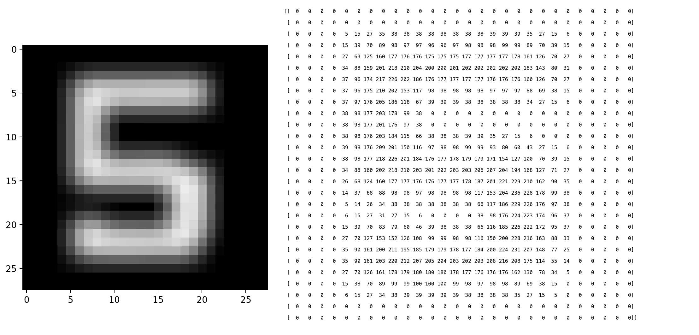
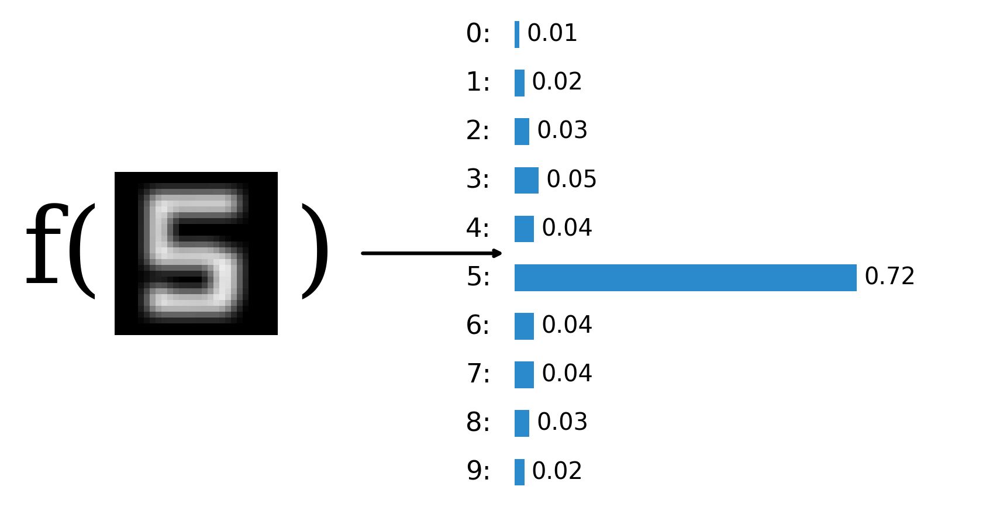

#+title: 和 AI 作朋友——高中生的 AI 工具箱
#+AUTHOR: 臺南一中 顏永進
#+DATE: 2026-04-30
#+SUBTITLE: 雲林場高中生 AI 工作坊
#+OPTIONS: toc:2 ^:nil num:5
#+OPTIONS: H:4
#+HTML_HEAD: <link rel="stylesheet" type="text/css" href="https://cdn.jsdelivr.net/gh/letranger/css@main/muse.css" />
#+HTML_HEAD_EXTRA: 

* 今天要做什麼？

很多人以為 AI 就是「幫你寫東西」，但真正厲害的用法，是「讓 AI 幫你做事情」。

今天我們要練的是「交辦」——三小時內，用 AI 工具從零完成一份 *真的可以上傳* 的台灣史學習歷程。

主題：*為什麼日本人選雲林蓋糖廠？*

| 階段 | 你做什麼                          | 帶走的東西                    |
|------+-----------------------------------+-------------------------------|
| 讀   | NotebookLM 消化糖業史料           | 含出處的研究筆記（Word 檔）    |
| 做   | Napkin 畫概念圖 + Claude 生 Word  | 一份小論文格式的 .docx 初稿    |
| 學   | ChatGPT 當教練改反思              | 有深度的反思，更新進 Word      |
| 簡報 | Gamma 或 Claude 做投影片          | 一份學習歷程簡報              |
| 創造 | （加分）AI Agent 做互動網頁       | 一個糖業史時間軸網站          |

每一段的產出直接餵進下一段。三小時後，你手上會有：一份 Word + 一份簡報，外加（如果你有時間）一個互動網頁。

** 為什麼選這個主題？

- 你現在人在雲林——虎尾糖廠就在隔壁。
- 108 課綱歷史第一冊第五章「拚經濟與求生存的人們」，日治時期產業發展就在考試範圍裡。
- 在地題材寫進學習歷程，跟別人的撞題率低，審查委員會記得你。

* AI 使用的五個層次

知道 AI 怎麼分等級，你會比同學更知道自己在哪、能往哪走。

| 階段                | 做法                                       | 代表工具                |
|---------------------+--------------------------------------------+-------------------------|
| Lv.1 問答機         | prompt → copy → paste                      | ChatGPT 網頁版          |
| Lv.2 整合工作流     | AI 嵌進你的工具裡                           | Copilot、NotebookLM     |
| Lv.3 AI Agent       | AI 自己規劃步驟、操作電腦                   | Claude Code、Gemini CLI |
| Lv.4 進階助理       | 你訓練它記得你的偏好                        | Skills / MCP            |
| Lv.5 專屬助理       | 自動完成每日任務、主動建議                  | OpenClaw、Hermes        |

大部分人卡在 Lv.1，所以寫出來的東西又累又像罐頭。今天直接跳到 Lv.3，並在收尾「點到」Lv.4——你要學的不是某一個工具，是「怎麼跟 AI 一起長」。

* 想不到題目？從這裡挑一個

老師示範的是「為什麼是雲林？」，你也可以選自己有興趣的：

| 編號 | 題目                                                         | 建議素材   |
|------+--------------------------------------------------------------+------------|
|    1 | 虎尾糖廠的冰為什麼特別好吃？——從一支冰棒認識糖廠還在做什麼    | 13, 3, 10  |
|    2 | 阿公阿嬤口中的「糖廠」是什麼樣子？——家族記憶裡的糖廠生活      | 4, 6, 10   |
|    3 | 那條鐵軌為什麼還在？——五分車從載甘蔗到載觀光客的故事          | 12, 2, 6   |
|    4 | 為什麼虎尾以前叫「糖都」？——一個小鎮怎麼變成全台最重要的糖廠  | 2, 4       |
|    5 | 日本人為什麼來雲林種甘蔗？——你家附近的田一百年前可能是甘蔗園  | 4, 1, 11   |
|    6 | 糖廠旁邊那些舊房子該拆掉嗎？——老建築保存 vs. 蓋新東西的兩難   | 12, 11     |
|    7 | 一顆方糖的旅程——從田裡的甘蔗到你桌上的糖，中間經過什麼？      | 4, 5, 13   |
|    8 | 糖廠關了，然後呢？——虎尾糖廠現在變成什麼樣子                  | 13, 12, 10 |

建議素材欄的編號對應底下的素材清單。也歡迎自己想題目！只要跟雲林糖業有關，就可以用 NotebookLM 裡的素材來研究。

* Step 1：NotebookLM——讀懂素材、產出研究筆記

** 先看 Lv.1 的限制

打開 [[https://chatgpt.com][ChatGPT]]，直接問：

#+begin_quote
日本人為什麼選擇在雲林虎尾蓋糖廠？
#+end_quote

ChatGPT 會給你一個看起來不錯的答案，但：
- 可能混入不正確的細節（幻覺）
- 不會提到「戊戌大水災」這個關鍵事件
- 沒有引用來源，你不知道哪句話是真的

這就是 Lv.1 的極限——你問一個問題，它給你一個答案，但你沒辦法驗證。接下來換 Lv.2 的方式。

** 上傳素材到 NotebookLM

打開 [[https://notebooklm.google.com][NotebookLM]]（用 Google 帳號登入），上傳以下四份資料：

1. [[https://zh.wikipedia.org/zh-tw/%E8%87%BA%E7%81%A3%E7%B3%96%E6%A5%AD%E5%8F%B2][臺灣糖業史——維基百科]]
2. [[https://vocus.cc/article/6667e00efd89780001a6eb91][臺灣「糖都」之父——虎尾糖廠]]
3. [[https://www.twcenter.org.tw/wp-content/uploads/2015/05/g02_07_02_05.pdf][近代產業——雲林糖業的興衰（楊彥騏）]]
4. [[https://www.taisugar.com.tw/chinese/Attractions_detail.aspx?n=10048&s=69&p=0][虎尾糖廠製糖工場——台糖官網]]

更多素材見底下的素材清單，共 13 份。如果你選的是其他學科的研究主題，也可以自己 Google 文獻、列印成 PDF 上傳。

** 依序問四個問題

*** 第 1 問（大方向）

#+begin_quote
根據這些資料，日本人為什麼選擇在雲林虎尾設立糖廠？有哪些關鍵因素？
#+end_quote

*** 第 2 問（追細節）

#+begin_quote
戊戌大水災跟糖廠設立的關係是什麼？請引用原文說明。
#+end_quote

*** 第 3 問（比較）

#+begin_quote
同一時期台灣其他地方也有糖廠，虎尾糖廠跟橋頭糖廠比起來，設廠條件有什麼不同？
#+end_quote

*** 第 4 問（學習歷程切入）

#+begin_quote
如果我要寫一篇小論文，題目是「為什麼是雲林？——日本人在虎尾蓋糖廠的五個原因」，你建議我的大綱怎麼寫？
#+end_quote

** 請 NotebookLM 幫你打包

問完之後，不要一個一個複製——貼這段指令讓它自己整合：

#+begin_quote
請把我們剛才所有對話的內容整合成一份「研究筆記」，格式如下：

一、研究問題：為什麼日本人選擇在雲林虎尾蓋糖廠？
二、關鍵發現：列出所有重要事實，每一點後面標明出處（來源文件名稱），例如：「1897 年戊戌大水災沖出大量溪埔地（出處：楊彥騏，〈近代產業——雲林糖業的興衰〉）」
三、比較分析：虎尾 vs. 其他糖廠的差異
四、建議大綱：小論文的章節架構
五、參考資料清單：列出所有引用過的文件名稱與作者
#+end_quote

這份研究筆記就是你接下來寫小論文的全部素材。

** 匯出成 Word 檔

NotebookLM 不太適合用來生成正式文件，但它的「文獻整合 + 出處標註」很強。我們把研究筆記匯出，下一步交給 Claude 寫小論文。

操作步驟：

1. 在剛才的回答底下點「儲存到記事」

#+ATTR_HTML: :width 500px

2. 這份記事會出現在 NotebookLM 的「工作室」（你的 AI 工具箱）。
3. 點開記事 → 選「匯出至文件」→ 拿到一份 .docx Word 檔。

#+ATTR_HTML: :width 500px

* Step 2：Napkin——畫一張概念結構圖

一篇好的小論文，核心不只是文字，而是「概念結構」——觀點之間有什麼關係？哪些是原因、哪些是結果？哪些並列、哪些對比？這些用圖表更清楚。

剛才 NotebookLM 整理出五個關鍵因素，現在我們把這五個因素的關係畫出來，寫作的時候就有清晰的架構。

打開 [[https://www.napkin.ai][Napkin]]，把這段貼進去：

#+begin_quote
日本選擇在雲林虎尾設立糖廠的原因：
1. 天災創造機會：1897 戊戌大水災沖出大量溪埔地，成為無主地，容易取得
2. 自然條件適合：雲林平原日照充足、雨量適中，甘蔗生長條件好
3. 政策推動：1902 年台灣總督府頒布糖業獎勵規則，提供設廠補助
4. 企業家眼光：鈴木藤三郎（製糖王）看中虎尾的潛力，1906 年設廠
5. 國家需求：日俄戰爭後，日本需要糖的自給自足，台灣是最近的產地
#+end_quote

→ Napkin 自動生成因果關係圖，下載備用，下一步要餵給 Claude。

當然，你也可以從 NotebookLM 的研究筆記裡挖出其他可以視覺化的內容，不一定只畫這五個原因。重點是用圖表把文字背後的結構表達出來——你的論文就不只是「寫出來」，而是「想出來」的。

* Step 3：Claude——生成小論文 Word 檔

打開 [[https://claude.ai][claude.ai]]（免費帳號即可）。

** 操作流程

1. 先貼上 *小論文格式規範* （見底下附錄，整段複製）
2. 上傳 Step 1 從 NotebookLM 匯出的 Word 檔（裡面有研究筆記與出處）
3. 上傳 Step 2 在 Napkin 做的因果關係圖
4. 貼這段指令：

#+begin_quote
請根據上面的「全國高級中等學校小論文寫作比賽格式說明」，把我提供的素材整理成一份符合格式的小論文，輸出為 Word 檔（.docx）。

基本資訊：
- 投稿類別：史地類
- 篇名：（你的題目）
- 作者：（你的姓名。學校。年級）
- 指導老師：（填你的老師）

大綱：
- 壹、前言：選題動機（用第一人稱寫）
- 貳、正文：分析素材中的關鍵因素，每個因素引用具體事實
- 參、結論：總結你的研究發現
- 肆、引註資料：根據素材中標示的出處自動生成，至少 3 篇

請嚴格遵守格式規範，反思段落請用高中生的口吻寫，不要太文言。
#+end_quote

5. Claude 生成 Artifact → 點「下載」→ 拿到 .docx 檔。

備案：如果 Claude 額度用完，可以用 [[https://gemini.google.com][Gemini]]，輸出後在 Google Docs → 檔案 → 下載 → Microsoft Word (.docx)。

** 下載後檢查事實

1. 把 AI 的用詞換成你自己的口吻
2. 檢查人名、年份、事件——AI 會編，不要照單全收
3. 反思段落先留著，下一步來改

* Step 4：ChatGPT——用 AI 當教練改反思

學習歷程最難的不是論文本體，是「反思」。一段流水帳的反思一看就是 AI 寫的，審查委員一年看幾千份，掰的他看得出來。

** Prompt 三招就夠用：給角色、給範例、給限制

對照同一題用兩種方式問，看差距：

爛 prompt：

#+begin_quote
幫我寫一段關於日治糖業的學習歷程反思
#+end_quote

→ 罐頭、流水帳，沒有你的影子。

好 prompt：

#+begin_quote
我住雲林，常經過虎尾糖廠，以前只覺得是一個老地方。這次研究之後才知道，原來日本人選雲林蓋糖廠不是巧合，是因為一場水災沖出了大片空地。幫我用這個「從不在意到覺得驚訝」的轉變，寫一段反思初稿。風格要像高中生自己寫的，不要太文言，300 字以內。
#+end_quote

→ 給了 AI 三件事：
1. *角色*：住在雲林的高中生
2. *範例*：從「不在意」到「驚訝」的轉變
3. *限制*：300 字以內、像高中生口吻

結論：你給 AI 多少「你的樣子」，它就回給你多少「你的樣子」。

** 接著用 AI 改，不是用 AI 寫

打開 [[https://chatgpt.com][ChatGPT]]（或 Claude），把初稿貼進去當教練修。至少來回三輪：

- 「這段反思沒有連結到我的研究問題，幫我指出哪裡可以改。」
- 「給我三種角度切入：我學到什麼能力 / 我對家鄉的看法改變什麼 / 我還想探索什麼」
- 「這句話怎麼改更有力？」

AI 是逼你想清楚的教練，不是幫你寫的槍手。

** 改完反思，更新進 Word

把改好的反思段落貼回 Step 3 的 Claude 對話框，請它把整篇文章的風格統一一遍：

#+begin_quote
這是我改寫過的反思段落：[貼上]

請把它整合進剛才的小論文，並確保整篇風格一致。重新輸出 Word 檔。
#+end_quote

下載最新版的 Word 檔——這時候才真正算是「你的」學習歷程。

* Step 5：Gamma 或 Claude——做簡報

把 Step 4 的 Word 檔直接餵給 [[https://gamma.app][Gamma]] 或 Claude，加一段提示詞：

#+begin_quote
高中歷史課程學習成果報告簡報。
標題：（你的題目）
內容包含：
一、研究動機
二、研究發現（重點整理）
三、學習反思
#+end_quote

→ Gamma 30 秒生成簡報；Claude 直接生成 .pptx 下載。

記得快速改一兩張：刪掉 AI 亂加的內容、補上自己的話。簡報是用來「說」的，不是用來「讀」的——每張投影片只留關鍵字，細節用嘴巴講。

* 進階：用 AI Agent 做更多（加分）

如果你想讓你的學習歷程跟隔壁不一樣——不只是 Word 檔——可以試試 AI Agent。

** 互動時間軸網頁

用 Claude Code 或 Gemini CLI，一句話下指令：

#+begin_quote
把這份雲林糖業報告做成一個互動時間軸網站：1906 大日本製糖設廠 → 1924 日搾量東洋第一 → 1945 戰後台糖接收 → 2000s 轉型文創園區
#+end_quote

AI 自己建檔案、寫 HTML/CSS/JS、跑起來。再追加：「加一個三題的選擇題小測驗」→ AI 自己改 code。

這份互動網頁連結放進學習歷程，審查委員會記得你。

** 封面視覺

用 [[https://ideogram.ai][Ideogram]] 生成封面圖：

#+begin_quote
日治時期台灣糖廠，五分車鐵道，甘蔗田，復古海報風格
#+end_quote

Ideogram 特別擅長有文字標語的海報。

** 紅線提醒

最後一關永遠是你——AI 交成品，掛名的是你。

* AI 到底怎麼辦到的？

** AI 的本質是「函數」

你在國中數學學過函數：輸入一個值、經過某個規則、得到一個輸出。

#+begin_example
華氏溫度 = 1.8 × 攝氏溫度 + 32
#+end_example

寫成 ~y = f(x)~，輸入攝氏 x，輸出華氏 f(x)。這個函數有兩個參數：1.8 和 32。把它想像成一個黑盒子，輸入一個值，根據兩個參數算出結果。

舉個更複雜的例子——學測落點預測。輸入你的學測成績，輸出可能錄取的大學機率：

#+ATTR_HTML: :width 500px

這也是一個 ~y = f(x)~：y 是錄取機率，x 是你的成績組合。簡化版可能長這樣：

#+begin_example
f(x) = 國文 × 0.3 + 英文 × 0.25 + 數學 × 0.35 + 社會 × 0.05 + 自然 × 0.05
#+end_example

實際上比這複雜得多（要考慮志願、歷年分布、加權…），但原理一樣：*輸入 → 函數 → 輸出*。

#+ATTR_HTML: :width 500px

那你應該也可以接受這樣一個函數：輸入 28×28 個小數（一張 28×28 灰階圖片，每個像素是 0-255 的亮度），輸出十個機率：

#+ATTR_HTML: :width 600px

這個函數做的是「手寫辨識」：吃一張數字圖片，輸出 0-9 各自的可能性。

#+ATTR_HTML: :width 600px

到這裡你應該已經可以接受 AI 是函數了。它能做哪些事？

| 任務     | 輸入       | → f → | 輸出             |
|----------+------------+-------+------------------|
| 手寫辨識 | 一張圖片   | → f → | 0~9 各數字的機率 |
| 貓狗辨識 | 一張照片   | → f → | 貓 90%、狗 10%   |
| 文字生成 | 一段提示詞 | → f → | 生成的文字       |
| 影像生成 | 一段描述   | → f → | 生成的圖片       |

不管 AI 看起來多厲害，骨子裡都是：*輸入 → 函數 → 輸出*。差別只在於函數裡有幾千億個參數（GPT-4 超過一兆個），這些參數是從海量資料中「學」出來的。

** 生成式 AI 是「會接龍的函數」

既然 AI 是函數，那生成式 AI 是什麼樣的函數？

答案：*一個每次只猜下一個字的函數，不斷把自己的輸出接回輸入，像接龍一樣。*

#+ATTR_HTML: :width 650px
[[file:img/06-blackboard.png]]

以「什麼是臺灣最美的風景？」為例：

#+ATTR_HTML: :width 700px
[[file:img/06-prob-step1.png]]

#+ATTR_HTML: :width 600px
[[file:img/06-prob-step2.png]]

#+begin_example
f("什麼是臺灣最美的風景？")           → 臺（機率最高）
f("什麼是臺灣最美的風景？臺")         → 灣
f("什麼是臺灣最美的風景？臺灣")       → 最
f("什麼是臺灣最美的風景？臺灣最")     → 美
  ……
f("什麼是臺灣最美的風景？臺灣最美的風景是") → 人
#+end_example

就像 LINE 鍵盤會自動建議下一個字——AI 做的是同一件事，只是猜得非常準。

但它不是每次都選機率最高的字，像轉輪盤一樣，機率高的容易被選中，但不一定：

#+ATTR_HTML: :width 600px
[[file:img/06-roulette.png]]

AI 加入一點隨機性（叫做「溫度參數」），讓回答更多樣。這也是為什麼你問同一個問題兩次，可能會得到不同的答案。

** Token：AI 眼中的世界

AI 看到的不是文字，而是 Token（一小段一小段的碎片）。

打開 [[https://platform.openai.com/tokenizer][OpenAI Tokenizer]] 試試：
- 輸入「虎尾糖廠」，看它被切成幾個 token
- 再輸入「314159」，數字的切法跟你想的完全不一樣
- 這就是為什麼 AI 有時候數學會算錯——它看到的不是「數字」，是碎片

** AI 怎麼被訓練出來的？

| 階段 | 做了什麼                      | 學會什麼          |
|------+-------------------------------+-------------------|
|    1 | 讀了整個網路的文字             | 語言的模式和規律 |
|    2 | 針對特定任務練習（Fine-tuning） | 怎麼當助理        |
|    3 | 人類告訴它什麼是好答案（RLHF） | 怎麼避免有害回應 |

** 幻覺（Hallucination）——AI 也會騙你

AI 有時候會一本正經地「編故事」，講得頭頭是道，但整段都是假的。這叫「幻覺」。

*為什麼會有幻覺？* 還記得剛才的「輪盤」嗎？AI 不是在「回憶事實」，是在「猜下一個最可能的字」——它沒辦法分辨「真的」跟「聽起來像真的」。

*** 實驗：用同一個問題去測四個 AI

請分別打開以下四個 AI，貼上 *完全相同的問題* ，比較它們的回答：

- [[https://chatgpt.com][ChatGPT]]
- [[https://claude.ai][Claude]]
- [[https://gemini.google.com][Gemini]]
- [[https://grok.com][Grok]]

問這個問題：

#+begin_quote
請描述 1920 年雲林農民組合抗議虎尾糖廠壓低甘蔗收購價格的經過
#+end_quote

*** 觀察重點

- 有沒有講出具體的人名、日期、地點？
- 四個 AI 講的是同一件事嗎？還是各說各話？
- 有沒有 AI 承認「我不確定」或「找不到相關資料」？
- 把它們的回答拿去跟 NotebookLM 裡的素材比對——哪些是真的、哪些是編的？

*** 結論

- AI 不是知識庫，是語言模型——它擅長的是「組織語言」，不是「記住事實」
- 四個 AI 可能給你四個不同版本的「歷史」，但真正的歷史只有一個
- *寫學習歷程的警告*：大學教授一年看幾千份，你掰的他看得出來
- 所以才需要 NotebookLM——有餵資料、有出處的回答，才值得信任

** 什麼東西不該丟給 AI？

AI 很強，但你打進去的每一個字，理論上都會離開你的電腦。

要小心的東西：
- 日記、心情筆記、感情問題、家裡狀況
- 同學的個資、輔導紀錄、申訴內容
- 還沒公開的競賽作品、原創小說、專題點子

進階解法（點到為止）：本機 AI（例如 ollama + 開源模型）跑在你自己的筆電上，資料完全不外流。效能比雲端弱，但夠用來改作文、整理日記。

一個判準：*「這段話如果被截圖貼到網路上，我會崩潰嗎？」* 會 → 別丟雲端。

* 你現在手上有什麼？

| 階段 | 成品                                              |
|------+---------------------------------------------------|
| 讀   | NotebookLM 研究筆記（Word 匯出）                   |
| 做   | Napkin 因果關係圖 + Claude 小論文 Word 初稿        |
| 學   | 跟 AI 來回三輪改出來的反思，更新進 Word 完成定稿   |
| 簡報 | Gamma 或 Claude 生成的報告簡報                    |
| 創造 | （加分）一個互動時間軸網頁 + 一張封面圖           |

三小時前你還在煩惱學習歷程怎麼寫，現在你手上有一份 Word + 一份簡報，可能還有一個互動網頁。

* 三個帶走的觀念

1. *AI 幫你加速，不是幫你代寫* ——最後掛名的是你
2. *你給 AI 多少「你的樣子」，它就回給你多少「你的樣子」* ——好的 prompt 比好的工具重要
3. *一定要自己檢查* ——AI 會編造事實，四個 AI 可能給你四個版本的「歷史」

* 老師的示範作品——跑完流程做出來長這樣

老師以「為什麼是雲林？」為題，跑了一輪上面的流程，做出來的東西放在這裡：

- *互動時間軸*（用瀏覽器打開）：[[file:虎尾糖廠時間軸.html][虎尾糖廠時間軸.html]]
- *小論文 Word 檔*（Step 3 + 4 的定稿）：[[file:虎尾糖廠小論文.docx][虎尾糖廠小論文.docx]]
- *Gamma 做的簡報*（Step 5 的一條路）：[[file:虎尾糖廠報告-Gamma.pptx][虎尾糖廠報告-Gamma.pptx]]
- *Claude 做的簡報*（Step 5 的另一條路）：[[file:虎尾糖廠報告.pptx][虎尾糖廠報告.pptx]]

工作坊跑完，你手上也會有類似的東西——而且是你自己選的題目、你自己的口吻。

* 素材清單——上傳到 NotebookLM

點開連結 → 瀏覽器按 =Ctrl+P= （Mac 按 =⌘+P= ）→ 「儲存為 PDF」→ 上傳到 NotebookLM。

** 主要素材（建議都上傳）

1. [[https://zh.wikipedia.org/zh-tw/%E8%87%BA%E7%81%A3%E7%B3%96%E6%A5%AD%E5%8F%B2][臺灣糖業史——維基百科]]（列印存 PDF）
2. [[https://vocus.cc/article/6667e00efd89780001a6eb91][臺灣「糖都」之父——虎尾糖廠]]（列印存 PDF）
3. [[https://www.taisugar.com.tw/chinese/Attractions_detail.aspx?n=10048&s=69&p=0][虎尾糖廠製糖工場——台糖官網]]（列印存 PDF）
4. [[https://www.twcenter.org.tw/wp-content/uploads/2015/05/g02_07_02_05.pdf][近代產業——雲林糖業的興衰（楊彥騏）]]（直接下載 PDF）
5. [[https://the.nmth.gov.tw/Uploads/Resource/Files/98d11ec4-cec9-42b0-9bcc-a3d281ceab7b.pdf][甜蜜蜜的時空之旅——臺灣糖業故事（台史博）]]（直接下載 PDF）

** 更多素材（有興趣再加）

6. [[https://smiletaiwan.cw.com.tw/article/4141][探訪糖與蜜之地——雲林虎尾百年糖廠（微笑台灣）]]
7. [[https://digitalarchives.tw/Exhibition/2424/1.html][從糖業的興衰看糖鄉虎尾的潛力（數位典藏）]]
8. [[https://opendata.culture.tw/frontsite/sugar][文化資料開放服務網——糖業的過去與現在（文化部）]]
9. [[https://www.taisugar.com.tw/monthly/CPN.aspx?ms=1495&p=13389178&s=13389186][臺灣糖業小史 1620-1901（台糖通訊）]]
10. [[https://www.taisugar.com.tw/monthly/CPN.aspx?ms=1485&p=13388859&s=13388881][虎糖與糖都所交織的特殊風情（台糖通訊）]]
11. [[https://curation.culture.tw/curation/public?id=1702][虎尾糖廠——國家文化記憶庫線上策展]]
12. [[https://ourisland.pts.org.tw/content/1084][台灣蔗糖的晚年記事——糖廠轉型困境（公視《我們的島》）]]
13. [[https://www.huweisugar.com/Course/Detail/3fba5042-a243-45f0-af61-1e6cb9f38ff4][說糖 HUWEI SUGAR——虎尾糖業文化路徑]]

* 附錄：小論文格式規範（整段複製，貼給 Claude）

格式說明原始 PDF：[[https://www.cdjh.hc.edu.tw/uploads/1589183819709PERVPvtb.pdf][點此下載]]

#+begin_example
【全國高級中等學校小論文寫作比賽格式說明】

壹、篇幅要求
小論文篇幅以 A4 紙張 4-10 頁為限（不含封面）。

貳、版面要求
一、使用新細明體 12 級字打字，不可放大字型，單行間距，邊界上下左右各留 2 公分。
二、版面編排
  （一）所有標題皆須單獨成行。
  （二）標題與段落之間要空一行。
  （三）段落與段落之間要空一行。
  （四）段落開頭與一般中英文寫作相同。
三、頁首及首尾：每頁頁首需加入小論文篇名，頁尾插入頁碼。文字為 10 級字、置中。

參、格式說明
小論文之基本架構分為「封面頁」及四大段落：「壹、前言」、「貳、正文」、「參、結論」、「肆、引註資料」

一、封面頁
  （一）單獨一頁、不編頁碼。
  （二）含投稿類別、小論文篇名、作者及指導老師。
  （三）不能有插圖。
  （四）作者依「姓名。學校。部別/年級」之順序編排。

二、前言
  為何選擇這個題目，透過什麼方法、運用什麼概念進行資料搜集，整篇文章的討論架構與範圍，以及想要達成的目的。

三、正文
  （一）「正文」為小論文之主體所在。
  （二）分層次、分段來條列說明。層次：一、→（一）→ 1、→（1）
  （三）強調相關資料的引用、彙整、分析、辯證。
  （四）引用別人資料需加註來源，直接引用原文以粗體加「」標明，標註（作者，年代）。
  （五）同一處引用原文不得超過 50 字。
  （六）圖/表需有編號及標題。圖編號在下，表編號在上，需註明資料來源。圖不得超過頁面 1/4。

四、結論
  研究過程中的思考、根據研究結果提出看法、未來值得進一步研究的方向。

五、引註資料
  至少 3 篇，不得全部來自網站。
#+end_example
